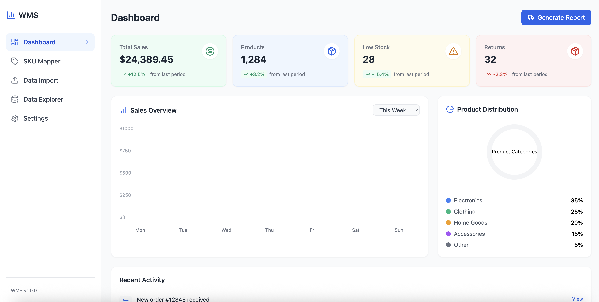

# Warehouse Management System (WMS)

A modern, full-featured warehouse management system built with React, TypeScript, and Tailwind CSS. This system helps businesses efficiently manage their inventory, track SKUs, analyze sales data, and make data-driven decisions through an intuitive interface.



## Features

### 🎯 Core Functionality
- **SKU Mapping**: Intelligent system for mapping SKUs to Master SKUs (MSKUs)
- **Data Import/Export**: Support for CSV, Excel, and JSON formats
- **Natural Language Queries**: AI-powered data exploration using plain English
- **Real-time Analytics**: Dynamic dashboards with key performance metrics
- **Multi-marketplace Support**: Handle SKUs across different sales channels

### 💡 Key Benefits
- **Automated Data Processing**: Reduce manual work and errors
- **Intelligent SKU Management**: Automatically detect and map SKU formats
- **Visual Analytics**: Make informed decisions with interactive charts
- **Flexible Import System**: Support for various file formats and structures
- **Error Prevention**: Built-in validation and error handling

## Code Examples

### SKU Mapping Implementation

```typescript
// Example of SKU mapping logic
const skuMapper = new SkuMapper();

// Add a new SKU mapping
const result = skuMapper.addMapping({
  id: '123',
  sku: 'APPLE-RED',
  msku: 'FRUIT-001',
  marketplace: 'Amazon',
  lastUpdated: new Date().toISOString()
});

// Search for SKUs
const searchResults = skuMapper.searchSkus('APPLE');
```

### Data Import Usage

```typescript
// Example of using the DataImporter
const importer = new DataImporter({
  encoding: 'utf-8',
  delimiter: ',',
  hasHeaderRow: true,
  trimWhitespace: true
});

// Process a CSV file
const result = await importer.processCsvFile(file);
console.log(`Processed ${result.processedRows} of ${result.totalRows} rows`);
```

### Database Queries

```typescript
// Example of using the Products hook
function ProductList() {
  const { products, loading, error, addProduct } = useProducts();

  async function handleAddProduct() {
    try {
      await addProduct({
        sku: 'NEW-SKU-001',
        msku: 'MASTER-001',
        name: 'New Product',
        description: 'Product description',
        marketplace: 'Amazon',
        price: 29.99,
        stock_level: 100
      });
    } catch (err) {
      console.error('Failed to add product:', err);
    }
  }

  if (loading) return <div>Loading...</div>;
  if (error) return <div>Error: {error.message}</div>;

  return (
    <div>
      {products.map(product => (
        <div key={product.id}>{product.name}</div>
      ))}
    </div>
  );
}
```

### Natural Language Query Example

```typescript
// Example of using the Natural Language Query service
const queryService = new NaturalLanguageQueryService();

// Convert natural language to SQL
const sql = queryService.convertToSql('Show me top selling products this month');
// Outputs: SELECT p.product_name, SUM(s.quantity) as total_sold 
//          FROM sales s 
//          JOIN products p ON s.product_id = p.product_id 
//          WHERE s.sale_date >= DATE_TRUNC('month', CURRENT_DATE)
//          GROUP BY p.product_name 
//          ORDER BY total_sold DESC 
//          LIMIT 10
```

## Tech Stack

### Frontend
- **React 18**: Modern UI development with hooks and concurrent features
- **TypeScript**: Type-safe development environment
- **Tailwind CSS**: Utility-first CSS framework for responsive design
- **Lucide Icons**: Beautiful, consistent icon system
- **React Router**: Client-side routing
- **React Dropzone**: Drag-and-drop file uploads
- **React Hot Toast**: Elegant notifications

### Backend
- **Supabase**: Backend as a Service for real-time data
- **PostgreSQL**: Robust database with JSON support
- **Row Level Security**: Built-in data security

### Data Management
- **Custom SKU Mapper**: Intelligent SKU to MSKU mapping system
- **Natural Language Processing**: Convert plain English to SQL queries
- **Data Import/Export**: Comprehensive data handling system
- **Error Handling**: Robust error management and reporting

## Getting Started

### Prerequisites
- Node.js 18.0 or higher
- npm 9.0 or higher

### Installation

1. Clone the repository:
```bash
git clone https://github.com/Suryanshu-Nabheet/Warehouse_Management_System.git
```

2. Install dependencies:
```bash
npm install
```

3. Set up environment variables:
```bash
cp .env.example .env
# Edit .env with your Supabase credentials
```

4. Start the development server:
```bash
npm run dev
```

### Database Setup

1. Create a new Supabase project
2. Run the migration scripts:

```sql
-- Create products table
CREATE TABLE IF NOT EXISTS products (
  id uuid PRIMARY KEY DEFAULT gen_random_uuid(),
  sku text UNIQUE NOT NULL,
  msku text NOT NULL,
  name text NOT NULL,
  -- ... other fields
);

-- Enable RLS
ALTER TABLE products ENABLE ROW LEVEL SECURITY;

-- Add policies
CREATE POLICY "Allow authenticated users to read products"
  ON products FOR SELECT
  TO authenticated
  USING (true);
```

### Production Deployment

1. Build the production bundle:
```bash
npm run build
```

2. Test the production build locally:
```bash
npm run preview
```

3. Deploy to your hosting provider:
```bash
npm run deploy
```

## Project Structure

```
warehouse-management-system/
├── src/
│   ├── components/     # Reusable UI components
│   ├── pages/         # Page components
│   ├── services/      # Business logic and API services
│   ├── models/        # Data models and types
│   ├── hooks/         # Custom React hooks
│   ├── lib/           # Utility libraries
│   └── types/         # TypeScript types
├── public/           # Static assets
└── tests/           # Test files
```

## Configuration

### Environment Variables

Create a `.env` file in the root directory:

```env
VITE_APP_TITLE=Warehouse Management System
VITE_SUPABASE_URL=your-supabase-url
VITE_SUPABASE_ANON_KEY=your-supabase-key
```

## Testing

Run the test suite:

```bash
# Run tests
npm run test

# Run tests with coverage
npm run test:coverage
```

Example test:

```typescript
import { render, screen } from '@testing-library/react';
import { SkuMapper } from '../src/models/SkuMapper';

describe('SkuMapper', () => {
  it('should correctly map SKUs', () => {
    const mapper = new SkuMapper();
    const result = mapper.addMapping({
      id: '123',
      sku: 'TEST-SKU',
      msku: 'MASTER-SKU',
      marketplace: 'Amazon',
      lastUpdated: new Date().toISOString()
    });
    
    expect(result.success).toBe(true);
    expect(mapper.getMsku('TEST-SKU')).toBe('MASTER-SKU');
  });
});
```

## Contributing

1. Fork the repository
2. Create your feature branch (`git checkout -b feature/AmazingFeature`)
3. Commit your changes (`git commit -m 'Add some AmazingFeature'`)
4. Push to the branch (`git push origin feature/AmazingFeature`)
5. Open a Pull Request

## License

This project is licensed under the MIT License - see the [LICENSE](LICENSE) file for details.

## Acknowledgments

- [React Documentation](https://react.dev)
- [Tailwind CSS](https://tailwindcss.com)
- [Vite](https://vitejs.dev)
- [TypeScript](https://www.typescriptlang.org)
- [Supabase](https://supabase.com)
